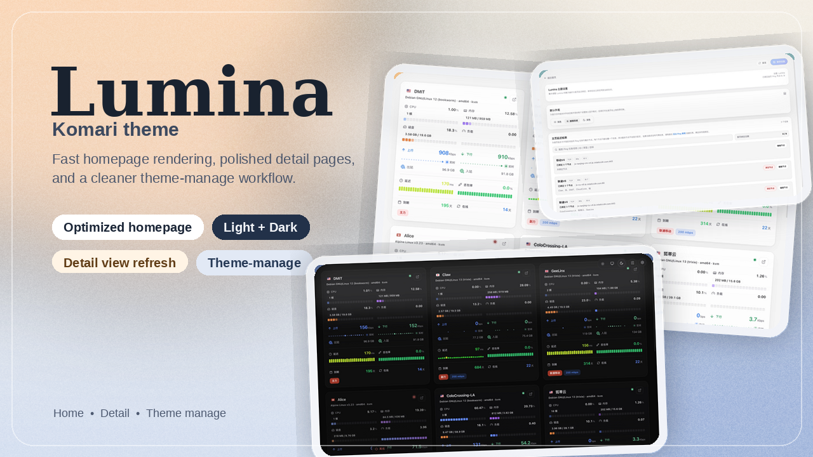

# Lumina for Nezha

Lumina 现已迁移为面向 [哪吒监控（Nezha）](https://github.com/nezhahq/nezha) 的前台主题版本，首页继续强调流畅度与卡片化信息密度，详情页保留高信息密度的状态展示风格。



## 截图

白日模式首页截图：


夜间模式首页截图：


管理面截图：


## 特性

- 首页节点数据改为直接消费哪吒 `/api/v1/ws/server` 实时流。
- 首页延迟概览改为映射哪吒服务监控数据，不再依赖旧版 Ping 任务绑定逻辑。
- 详情页负载历史改为读取哪吒 `metrics` 接口，支持实时、1 天、7 天、30 天展示。
- 详情页 Ping 图表改为读取哪吒 `service` 历史接口。
- 前台不再内置主题管理面板，后台入口统一跳转到 `/dashboard/`。

## 当前限制

- 本仓库只实现哪吒前台主题接入，不修改哪吒后端。
- 旧版前端主题管理页已停用，仓库内相关逻辑已移除。
- 若需调整节点、服务监控、登录等配置，请前往哪吒后台 `/dashboard/`。

## 安装

1. 安装并启动哪吒面板与 Agent。
2. 将本仓库作为前端工程构建：

```bash
npm install
npm run build
```

3. 将 `dist/` 部署到你的哪吒前端静态资源环境，或通过反向代理与哪吒后端 `/api/v1/*` 联通。

### 可选：部署 Lumina 聚合 sidecar（推荐）

如果你需要首页聚合接口，或希望详情页负载历史支持 `7 天 / 30 天` 在“已有多少历史就显示多少历史”的效果，推荐同时部署仓库里的 sidecar：

- 服务文件：`scripts/lumina-home-api.service`
- Python 脚本：`scripts/lumina_home_api.py`

一个常见部署目录示例：

- 前端静态文件：`/opt/lumina/dist`
- sidecar 脚本：`/opt/lumina/lumina_home_api.py`
- systemd 服务：`/etc/systemd/system/lumina-home-api.service`

#### 认证环境文件

为了让 sidecar 以已登录身份读取哪吒 Dashboard 的 `7d / 30d` metrics，建议使用单独的环境文件，而不是把账号密码直接写进 service override。

建议路径：

- `/etc/lumina/lumina-home-api.env`

示例内容可参考：

- `scripts/lumina-home-api.env.example`

服务器上的实际文件建议写成：

```bash
mkdir -p /etc/lumina
cat > /etc/lumina/lumina-home-api.env <<'EOF'
LUMINA_DASHBOARD_USERNAME=lumina_service
LUMINA_DASHBOARD_PASSWORD=请替换为你的密码
EOF
chmod 600 /etc/lumina/lumina-home-api.env
chown root:root /etc/lumina/lumina-home-api.env
```

#### systemd override 示例

建议通过 override 引用环境文件：

```bash
mkdir -p /etc/systemd/system/lumina-home-api.service.d
cat > /etc/systemd/system/lumina-home-api.service.d/auth.conf <<'EOF'
[Service]
EnvironmentFile=/etc/lumina/lumina-home-api.env
EOF
```

然后重载并重启：

```bash
systemctl daemon-reload
systemctl restart lumina-home-api.service
systemctl status lumina-home-api.service
```

#### 安全建议

- 不要把真实账号密码提交到仓库
- 环境文件权限至少应为 `600`
- sidecar 建议仅监听本机，例如 `127.0.0.1:18080`
- 如果未来哪吒支持更细粒度的只读 token，优先改用 token 方案

## 开发

要求：

- Node.js 22+
- npm

安装依赖：

```bash
npm install
```

本地开发：

```bash
npm run dev
```

构建：

```bash
npm run build
```

打包产物：

```bash
npm run package
```


### 一键免密部署

首次使用先配置 SSH key 登录服务器，保证本机执行下面命令不会要求输入密码：

```bash
ssh 你的用户@你的服务器
```

然后复制部署配置模板：

```powershell
Copy-Item .deploy.env.example .deploy.env
```

在 `.deploy.env` 中填写 `DEPLOY_HOST`、`DEPLOY_USER`、`DEPLOY_PATH`，如需指定私钥则填写 `DEPLOY_IDENTITY_FILE`。

之后每次只需运行：

```bash
npm run deploy
```

脚本会自动执行 `npm run build`，再通过 SSH 将 `dist/` 同步到服务器。脚本使用 `BatchMode=yes`，不会交互式要求输入密码；如果免密登录没配置好，会直接失败并提示先配置 SSH key/ssh-agent。若配置 `DEPLOY_RESTART_COMMAND` 且需要 `sudo`，请在服务器上配置免密 sudo，并使用 `sudo -n ...`。

## 参考

- [哪吒开发接口文档](https://nezha.wiki/developer/api.html)
- [哪吒监控仓库](https://github.com/nezhahq/nezha)
- [Mochi 主题](https://github.com/svnmoe/komari-web-mochi)
- [PurCarte 主题](https://github.com/Montia37/komari-theme-purcarte)
